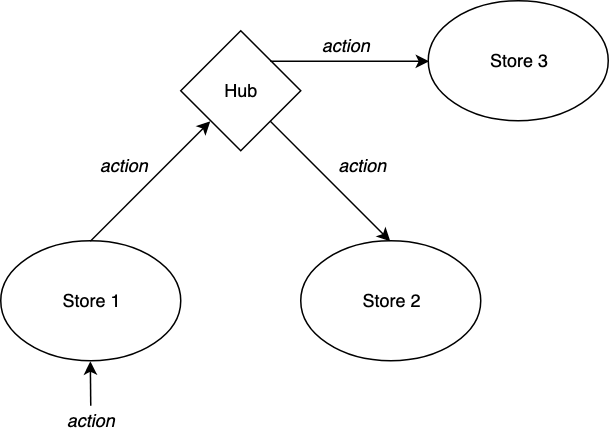

# Redux Hub Middleware

This Redux middleware's purpose is to allow actions dispatched on multiple stores at once by transparently re-dispatching them.



It is likely to be used in large React/Redux-based projects having multiple sub-apps having own and *isolated* stores:

```jsx harmony
<WrapperOrRouterSetup>
    <AppFirst/>{/* which has own store */}
    <AppSecond/>{/* which has another store */}
</WrapperOrRouterSetup>
```


Let's say `AppFirst` needs to share data with `AppSecond`. Then
we need this data placed on higher level. One of the solutions is to *connect* Redux stores
to the hub:

```jsx harmony

import { createStore, applyMiddleware } from 'redux';
import createReduxHub from 'redux-hub-middleware';

const hub = createReduxHub();

function reducer1(state = 'store1 initial', action) {
  if (action.type === 'CHANGE') {
    return action.value;
  }
  
  return state;
}

function reducer2(state = 'store2 initial', action) {
  if (action.type === 'CHANGE') {
    return action.value;
  }
  
  return state;
}

const store1 = createStore(reducer1, applyMiddleware(hub.middleware));

const store2 = createStore(reducer2, applyMiddleware(hub.middleware));

hub.connect(store1);
hub.connect(store2);

store1.dispatch({type: 'CHANGE', value: 'foo'});
store2.getState(); // returns 'foo'

store2.dispatch({type: 'CHANGE', value: 'bar'});
store1.getState(); // returns 'bar'

```

A newly created hub could be passed to application components for later use:

```jsx harmony
import React from 'react';

import createReduxHub from 'redux-hub-middleware';

const hub = createReduxHub();

React.render(
    <WrapperOrRouterSetup>
        <AppFirst reduxHub={hub}/>{/* hub is passed as prop to use it later in store initialization */}
        <AppSecond reduxHub={hub}/>
    </WrapperOrRouterSetup>,
    root
)
```

**Important note**. The hub is working in bi-directional way. So any action dispatched at any connected store will be passed to others.

## API

The library exposes `createReduxHub` function which takes no arguments and returns
new hub instance containing `connect` and `middleware` functions:

```jsx harmony
const { connect, middleware } = createReduxHub();
```

`middleware` function must be added to middleware list when a store is created:

```jsx harmony
import { createStore, applyMiddleware } from 'redux';
import createReduxHub from 'redux-hub-middleware';

const { connect, middleware } = createReduxHub();

const store = createStore(reducer, applyMiddleware(middleware));
```


`connect` function is used to connect stores to a hub:

```jsx harmony
import { createStore, applyMiddleware } from 'redux';
import createReduxHub from 'redux-hub-middleware';

const { connect, middleware } = createReduxHub();

const store = createStore(reducer, applyMiddleware(middleware));

connect(store);
```

After connection all actions dispatched in one store will be re-dispatched on all other connected stores.
